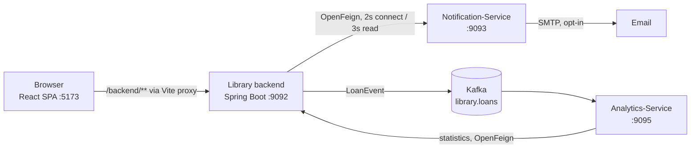

# Library Management System

A library platform built as a Spring Boot backend in Hexagonal Architecture, a React single-page
frontend, and two supporting services. Members browse and borrow from the catalogue; administrators
manage books, authors, members and loans.

## Components

| Component                | Path                                         | Port       | Store          | Required? |
| ------------------------ | -------------------------------------------- | ---------- | -------------- | --------- |
| **Library backend**      | `Library-Management-System-Version-2/`       | 9092       | H2 (in-memory) | yes       |
| **Frontend**             | `frontend/`                                  | 5173 (dev) | —              | yes       |
| **Notification-Service** | `Notification-Service/Notification-Service/` | 9093       | MySQL          | optional  |
| **Analytics-Service**    | `Analytics-Service/`                         | 9095       | H2 (in-memory) | optional  |

Both supporting services are genuinely optional: the backend degrades rather than fails when they
are absent. Borrowing a book still succeeds if Notification-Service is down or Kafka is unreachable.



## Ports

| Port | What                            |
| ---- | ------------------------------- |
| 5173 | frontend dev server             |
| 9092 | library backend (HTTP)          |
| 9093 | Notification-Service (HTTP)     |
| 9094 | Kafka broker                    |
| 9095 | Analytics-Service (HTTP)        |
| 3306 | MySQL, for Notification-Service |

The broker's 9094 is the one fixed point: both the library (producer) and Analytics-Service
(consumer) are configured against it, so services move around it rather than the other way.

## Starting everything at once

```powershell
.\dev.ps1            # backend + frontend
.\dev.ps1 -All       # plus Notification-Service and Analytics-Service
.\dev.ps1 -Stop      # free every port the stack uses
```

Each service opens in its own window so its logs stay readable and Ctrl+C stops the one you meant.
A port already in use is reported and skipped rather than fought over. `-Stop` exists because a
killed Maven wrapper leaves its Java child running, still holding the port.

The steps below are the same thing by hand.

## Prerequisites

- JDK 21
- Maven 3.9.9 (or the bundled `mvnw` wrappers)
- Node.js with npm — frontend only
- MySQL — Notification-Service only
- Kafka — Analytics-Service only

## Quick start

Backend and frontend are enough to run the whole application.

**1. Backend** — from `Library-Management-System-Version-2/`:

```bash
./mvnw spring-boot:run       # http://localhost:9092
```

On first start with an empty catalogue the backend stocks itself from Open Library
(~40 books across 12 subjects). To skip the network call and use the bundled JSON fixture
instead, run with the `dev` profile:

```bash
./mvnw spring-boot:run -Dspring-boot.run.profiles=dev
```

**2. Frontend** — from `frontend/`:

```bash
npm install
npm run dev                  # http://localhost:5173
```

### Signing in

The backend bootstraps **one** account, an administrator: **`admin` / `admin`**.

Everything else is self-registration, which only ever creates members — so the administrator
account is the only way into the admin screens. Override the password outside local runs:

```bash
export LIBRARY_ADMIN_PASSWORD=…   # blank disables creating the account altogether
```

### Optional services

**Notification-Service** — needs MySQL on 3306. From `Notification-Service/Notification-Service/`:

```bash
./mvnw spring-boot:run       # http://localhost:9093
```

Email delivery is off by default (`notification.mail.enabled=false`): notifications are still
persisted and returned as `PENDING`, so nothing fails against an unconfigured mailbox. To send
real mail, fill in `spring.mail.username` / `spring.mail.password` and flip the flag.

**Analytics-Service** — needs a Kafka broker on 9094. It consumes `library.loans` and rebuilds
book statistics from the topic, so its H2 store is a projection rather than a source of truth and
can be thrown away. From `Analytics-Service/`:

```bash
./mvnw spring-boot:run       # http://localhost:9095
```

| Endpoint                                       | Returns                 |
| ---------------------------------------------- | ----------------------- |
| `GET /api/v1/analytics/summary`                | totals across all loans |
| `GET /api/v1/analytics/popular-books?limit=10` | most-borrowed books     |

Without a broker the service still starts — `spring.kafka.listener.missing-topics-fatal=false`
keeps it from logging a stack trace every few seconds — it just never sees an event.

## Configuration

The switches worth knowing, all in the backend's `application.properties`:

| Property                        | Default       | Effect                                                                    |
| ------------------------------- | ------------- | ------------------------------------------------------------------------- |
| `library.events.enabled`        | `true`        | Publish loan events to Kafka. Borrowing works either way.                 |
| `notification.enabled`          | `true`        | Call Notification-Service on borrow. Borrowing works either way.          |
| `analytics.enabled`             | `true`        | Read statistics from Analytics-Service for the admin Insights page.       |
| `library.catalog.seed.enabled`  | `true`        | Stock an empty catalogue from Open Library on first start.                |
| `library.reminders.cron`        | `0 0 8 * * *` | Daily sweep for loans due soon.                                           |
| `library.reminders.days-before` | `3`           | How far ahead that sweep looks.                                           |
| `spring.cache.type`             | `simple`      | In-memory cache. Redis is on the classpath but not assumed to be running. |

Caching is set to `simple` deliberately: `spring-boot-starter-data-redis` is a dependency, so Boot
would otherwise auto-select Redis and every cached call would fail against a server that is not
there. Switch to `redis` once one is.

## Testing

From `Library-Management-System-Version-2/`:

```bash
./mvnw test                          # 110 unit tests, ~1 min
./mvnw verify                        # those plus 132 integration tests, ~3.5 min
./mvnw -f pom-docker.xml verify      # integration tests against Docker
```

Two plugins split the work by filename: **surefire** runs `*Test` at the `test` phase, **failsafe**
runs `*IT` at `integration-test`. The suffix is the whole mechanism — a new integration test is
picked up by being named `…IT.java` and by nothing else.

|         | surefire                   | failsafe           |
| ------- | -------------------------- | ------------------ |
| Phase   | `test`                     | `integration-test` |
| Matches | `*Test`, `Test*`, `*Tests` | `*IT`              |
| Count   | 118                        | 132                |

From `frontend/`:

```bash
npm test                          # 33 unit tests (Vitest), no server needed
npm run test:e2e                  # 16 end-to-end tests (Playwright) — needs the backend on :9092
npm run build                     # tsc type-check, then production build
```

| Suite               | Tool                  | Needs a server?       | Count |
| ------------------- | --------------------- | --------------------- | ----- |
| Backend unit        | surefire              | no                    | 118   |
| Backend integration | failsafe              | no (in-memory H2)     | 132   |
| Frontend unit       | Vitest + jsdom        | no                    | 33    |
| Frontend e2e        | Playwright + Chromium | yes, backend on :9092 | 16    |

The e2e suite starts the Vite dev server itself, and skips with an explanation when the backend is
not running rather than failing as though the frontend were broken.

## API

The backend serves REST under these roots, plus Swagger UI via springdoc:

| Root                 | Purpose                               |
| -------------------- | ------------------------------------- |
| `/api`               | login, register, logout, current user |
| `/api/profile`       | the signed-in account's own details   |
| `/api/reminders`     | due-date reminder sweep               |
| `/books`, `/authors` | catalogue                             |
| `/customers`         | members — admin only                  |
| `/transactions`      | borrow, return, history               |
| `/admin`             | administrative operations             |

Responses use HATEOAS links and HTTP caching. `frontend/README.md` documents the API's quirks that
the client has to work around — paginated endpoints answering 404 instead of an empty page, plain-text
bodies on some routes, and identifier fields named `bookId` / `customerId` rather than `id`.

## Continuous integration

`.github/workflows/ci.yml` runs on every push to `main` and every pull request:

| Job                  | What it does                                                                                            |
| -------------------- | ------------------------------------------------------------------------------------------------------- |
| **java** (matrix ×3) | Checkstyle, then `mvnw verify` — unit tests, integration tests and PMD — for each of the three services |
| **frontend**         | `npm ci`, type-check, unit tests, production build                                                      |
| **e2e**              | Starts the backend, then drives Chromium through the Playwright suite                                   |

All three services are built on every change, not only the one that changed: they share a Kafka
topic and an HTTP contract, so a change to one can break another without touching its files. The
matrix runs with `fail-fast: false` so one red service does not hide the state of the other two.

Test reports are published to the run summary, and on failure the surefire/failsafe reports, PMD
and Checkstyle XML, and the Playwright trace are uploaded as artifacts.

## Code style

One Checkstyle ruleset and one PMD ruleset in `config/`, shared by all three services so they are
held to the same standard from a single file:

```
config/checkstyle/checkstyle.xml
config/pmd/ruleset.xml
```

Each service's POM points at them with a relative path. Both fail the build — Checkstyle at
`validate`, PMD at `verify`. See the [backend README](Library-Management-System-Version-2/README.md)
for what is in them and why several rules are excluded.

## Architecture

[`docs/architecture/`](docs/architecture/README.md) has a page per component — what it owns, how it
talks to the others, and what happens when it is missing:

- [Overview](docs/architecture/README.md)
- [Library backend](docs/architecture/library-backend.md)
- [Frontend](docs/architecture/frontend.md)
- [Notification-Service](docs/architecture/notification-service.md)
- [Analytics-Service](docs/architecture/analytics-service.md)

## Repository layout

```
Library-Management-System-Version-2/   Spring Boot backend (Hexagonal Architecture)
  src/main/java/app/
    adapters/input/rest/               REST controllers
    adapters/output/                   JPA repositories and entities
    domain/                            domain model and ports
    infrastructure/config/             security, caching, seeding
frontend/                              React 19 + TypeScript + Vite SPA
Notification-Service/                  email notifications and preferences
Analytics-Service/                     Kafka consumer, loan statistics
docs/architecture/                     one page per component, and how they fit
docs/decisions/                        dated design specs
config/                                Checkstyle and PMD rulesets, shared by all services
.github/workflows/ci.yml               the pipeline
dev.ps1                                starts the whole stack
```

## Technologies

**Backend** — Java 21, Spring Boot 3.5.4, Spring Data JPA (Hibernate), Spring Security with JWT
(jjwt), Spring HATEOAS, Spring Kafka, Spring Cloud OpenFeign, Spring Cache, Thymeleaf, springdoc
OpenAPI, ModelMapper, Lombok, H2, MySQL, JUnit, Mockito.

**Frontend** — React 19, TypeScript, Vite, React Router.

## License ⚖️

MIT — see [LICENSE](LICENSE).
