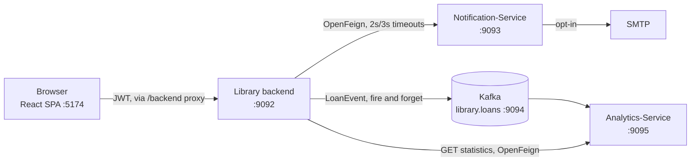

# Architecture

The system is four deployables: one application that owns the library, two services that react to
it, and a browser client.

| Component                                       | Role                                            | Port | Store          | Required? |
| ----------------------------------------------- | ----------------------------------------------- | ---- | -------------- | --------- |
| [Library backend](library-backend.md)           | Owns the catalogue, members, loans and identity | 9092 | H2 (file)      | yes       |
| [Frontend](frontend.md)                         | React SPA, the only human-facing surface        | 5174 | —              | yes       |
| [Notification-Service](notification-service.md) | Sends and records notifications                 | 9093 | MySQL          | optional  |
| [Analytics-Service](analytics-service.md)       | Counts what the library lends                   | 9095 | H2 (in-memory) | optional  |

## How they fit together

Note the two different arrows into the services. Both are deliberate:

- **The library never waits on anything it does not own.** Notification is a side effect of
  borrowing, and loan events are published fire-and-forget with a 2-second `max.block.ms`. Both
  services can be down and a member can still borrow a book.
- **Reads are different from writes.** The browser is never given a second origin to talk to;
  Analytics-Service has no authentication of its own, so the library proxies the read behind its
  own JWT and admin check.

## The rule that shapes everything

**The library owns the truth; the other services own projections of it.**

Analytics-Service's totals are rebuilt from the `library.loans` topic and can be thrown away.
Notification-Service records what it sent, but the library keeps the authoritative copy of a
member's reminder preference. Neither service is ever asked a question the library needs an answer
to in order to function.

That is what makes them optional, and what stops "the notification service is down" from becoming
"nobody can borrow a book".

## Degrading rather than failing

Each outbound integration has a documented behaviour when the other end is missing:

| Missing                  | What happens                                             |
| ------------------------ | -------------------------------------------------------- |
| Notification-Service     | Borrowing succeeds; the failure is logged and swallowed  |
| Kafka broker             | Borrowing succeeds; the event is dropped after 2s        |
| Analytics-Service        | `/admin/analytics` answers **503**, and Insights says so |
| Kafka, with Analytics up | Insights shows its figures marked **not up to date**     |

The last row is the subtle one: a reachable service with no broker behind it holds zeros, and
presenting those as fact would claim the library has never lent a book. See
[Analytics-Service](analytics-service.md#being-up-is-not-the-same-as-being-fed).

## Ports

| Port | What                            |
| ---- | ------------------------------- |
| 5174 | Frontend dev server             |
| 9092 | Library backend                 |
| 9093 | Notification-Service            |
| 9094 | Kafka broker                    |
| 9095 | Analytics-Service               |
| 3306 | MySQL, for Notification-Service |

The broker's 9094 is the fixed point: both the producer and the consumer are configured against it,
so services move around it rather than the other way.

## Further reading

- [Library backend](library-backend.md) — hexagonal architecture, security, the domain
- [Frontend](frontend.md) — routes, API client, error handling
- [Notification-Service](notification-service.md)
- [Analytics-Service](analytics-service.md)
- [`../decisions/`](../decisions/) — design specs, dated, as agreed at the time
