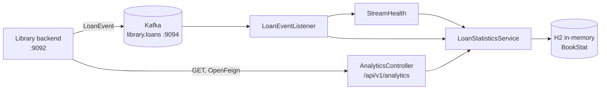

# Analytics-Service

Spring Boot, Java 21, port 9095. Consumes loan events from Kafka and keeps a running tally of what
the library lends. Source: `Analytics-Service/`.

**Optional.** Without it the library works unchanged and the Insights page says it is not running.

## Shape



Events in, statistics out. The service is fed by the topic and never calls back into the library —
`LoanEvent` carries everything it needs.

## The topic is the contract

The library publishes `LoanEvent` to `library.loans` on every borrow and return. The record is kept
structurally identical on both sides:

```java
record LoanEvent(
    String type,          // BOOK_BORROWED | BOOK_RETURNED
    UUID customerId, String customerName,
    UUID bookId, String bookTitle, String bookIsbn,
    Instant occurredAt) {}
```

Changing one side means changing the other. Unknown event types are **ignored rather than rejected**,
so the library can add new ones without this service having to ship first.

## Storage is a projection, not a source of truth

H2 in-memory, one `BookStat` row per book: `bookId`, `title`, `isbn`, `timesBorrowed`,
`timesReturned`, `lastActivity`, with `currentlyOut` derived.

The consumer reads with `auto-offset-reset=earliest`, so a restart replays the topic from the
beginning and rebuilds everything. Nothing here needs backing up: throw the database away and it
comes back.

## Being up is not the same as being fed

The summary carries `streamConnected` alongside the totals, because "reachable" and "receiving
events" are different things and only one of them makes the numbers mean anything:

| This service | The broker | `streamConnected` | The Insights page shows                |
| ------------ | ---------- | ----------------- | -------------------------------------- |
| down         | —          | (503)             | "Analytics-Service isn't running"      |
| up           | down       | `false`           | the figures, marked **not up to date** |
| up           | up         | `true`            | the figures                            |

Without that middle row, a healthy service with no broker behind it reports zeros that read as
fact — and a library with a book out is told nothing has ever been borrowed. This was a real
defect: the service answered `200` with an empty projection while an active loan sat in the
library's own database.

`StreamHealth` derives the flag from the listener container's **partition assignments**: a consumer
holding assignments is by definition talking to a broker, and the answer costs no I/O. It is also
`false` in the moments after start-up before the group has rebalanced, and when the broker is up but
the topic does not exist yet — in both cases nothing can arrive, which is what the caller is asking.

## API

| Endpoint                                       | Returns                                                                                          |
| ---------------------------------------------- | ------------------------------------------------------------------------------------------------ |
| `GET /api/v1/analytics/summary`                | `booksTracked`, `totalBorrows`, `totalReturns`, `currentlyOut`, `streamConnected`, `lastEventAt` |
| `GET /api/v1/analytics/popular-books?limit=10` | most-borrowed books with per-book counts                                                         |

**No authentication.** The browser never calls this service directly; the library proxies it behind
`/admin/analytics`, which is already behind a JWT and an admin role check. Exposing 9095 publicly
would publish the library's borrowing history.

## Ports

HTTP is **9095**, the broker is **9094**. These were both 9094 at one point, which cannot work — a
service cannot bind a port and also dial a broker on it. The broker's 9094 is the fixed point, since
the library publishes there, so this service moved.

Without a broker the service still starts: `spring.kafka.listener.missing-topics-fatal=false` keeps
it from logging a stack trace every few seconds. It simply never sees an event.

## Running

From the repository root:

```bash
./mvnw -pl Analytics-Service spring-boot:run       # http://localhost:9095
```

See [`../../Analytics-Service/README.md`](../../Analytics-Service/README.md).
