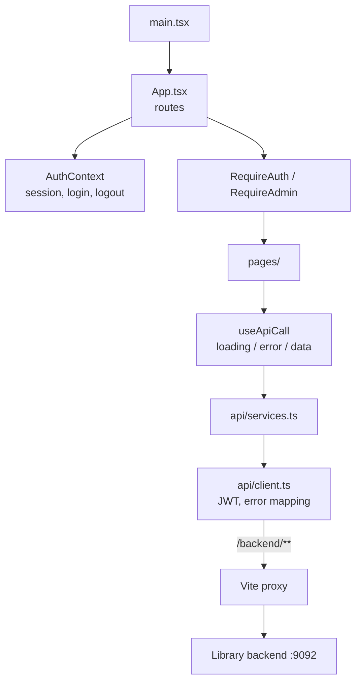

# Frontend

React 19, TypeScript, Vite. Port 5174 in development. The only human-facing surface in the system.
Source: `frontend/`.

## Shape



Layers, outermost first: routes → guards → pages → `useApiCall` → typed service calls → the fetch
wrapper. A page never calls `fetch` and never sees an HTTP status.

## Routes

| Route                       | Who           | Page                                                |
| --------------------------- | ------------- | --------------------------------------------------- |
| `/login`, `/register`       | anyone        | sign in, sign up                                    |
| `/books`                    | member, admin | catalogue; admins also add, edit, delete and import |
| `/discover`                 | member, admin | browsing by subject                                 |
| `/account`, `/account/:tab` | member, admin | own profile and loans                               |
| `/loans`                    | **admin**     | every loan in the library                           |
| `/customers`                | **admin**     | member list                                         |
| `/insights`                 | **admin**     | borrowing statistics from Analytics-Service         |

The nav hides admin tabs for members and `RequireAdmin` explains the restriction if someone types
the URL. Both are conveniences — the real rule lives in `SecurityConfig.java` on the backend, which
answers 403 regardless.

## Talking to the backend

The backend has **no CORS configuration**, so a direct call from :5174 to :9092 would be blocked.
`vite.config.ts` proxies everything under `/backend` instead, which makes every request same-origin
from the browser's point of view:

```
browser → /backend/books/paginated → vite proxy → localhost:9092/books/paginated
```

For production, either serve the built `dist/` from the Spring app (same-origin, no CORS) or deploy
separately and add a `CorsConfigurationSource` bean.

The frontend knows **one** origin. Analytics-Service is read through the library's
`/admin/analytics` rather than directly, so no unauthenticated service is ever exposed to a browser.

## Authentication

`POST /api/login` returns a JWT. It is stored in `localStorage` under `library.jwt`, the identity
under `library.session`, and attached to every subsequent request by `client.ts`.

- **401** — the token is missing, expired or rejected: the client drops it and redirects to `/login`.
- **403** — the token is fine but the account may not go there. The token is **kept** and the error
  shown in place; signing the user out would be the wrong answer.

> `localStorage` is readable by any JavaScript on the page and so is vulnerable to XSS. It is the
> pragmatic choice for a stateless JWT backend; an httpOnly cookie would be stronger and requires
> backend changes.

## Errors are sentences, not status codes

Nothing in the UI shows an HTTP status code. `Request failed with status 502` is a fact about HTTP,
not about the library, and there is nothing a reader can do with it.

`client.ts` resolves a failure in this order:

1. **The server's own message**, when it reads like a sentence — validation errors are written for
   people and beat anything the client can invent.
2. **A sentence for the status class** otherwise: 502/503/504 becomes *"The library server is not
   responding. It may be restarting — try again in a moment."*
3. **`OfflineError`** when `fetch` rejects outright, meaning the request never arrived. The browser's
   own wording is "Failed to fetch"; ours says the library cannot be reached.

HTML bodies are discarded before display — the Vite proxy and Spring's error page both answer with
HTML when the backend is down. Bodies over 300 characters are dropped for the same reason.

Failures a reload would fix render through `ErrorNotice`, which offers a **Try again** button, so
recovering from a restarting backend is one click rather than a page refresh.

## Backend quirks absorbed here

Real behaviours of the API that the client hides, so no page has to know about them:

- **Paginated endpoints answer 404, not an empty page**, when there are no rows. `getPage()`
  translates that to an empty result.
- **Search endpoints answer 404 with plain text** when nothing matches; `getList()` returns `[]`.
- **Some endpoints return plain text**, not JSON. The client falls back to the raw string.
- **`GET /admin/analytics` answers 503** when Analytics-Service is down; `analyticsApi.overview`
  resolves that to `null` so the page can tell "could not be read" from "nothing to read". This has
  to live in the service layer because `useApiCall` keeps only the error *message*, not its status.
- **Identifiers are `bookId` / `customerId`**, never `id`.
- **`available`, not `isAvailable`** — Jackson strips the `is` prefix from the Java getter.

## Tables

`BooksPage` and `InsightsPage` render with `table-layout: fixed`, so a column never grows to fit its
contents. Nothing clips either, which means a column that is too narrow does not truncate — its
contents spill over the next one. The status pill is `white-space: nowrap` and cannot shrink; it
once landed on top of the Edit button and made it unclickable.

So every width must fit the widest thing its column can hold, and the admin view — which carries an
extra actions column — declares its own set via `.books-table.has-actions`.

## Testing

| Suite      | Tool                            | Needs a server?       |
| ---------- | ------------------------------- | --------------------- |
| Unit       | Vitest + Testing Library, jsdom | no                    |
| End-to-end | Playwright + Chromium           | yes, backend on :9092 |

The e2e suite starts the Vite dev server itself and **skips with an explanation** when the backend
is absent — a missing server is not a broken frontend, and a suite that goes red for that teaches
people to ignore red suites.

TypeScript is split into two projects: `tsconfig.app.json` for browser code, with no `node` types so
a stray `process.env` is a compile error, and `tsconfig.node.json` for the config files and the
Playwright suite, which run in Node.
