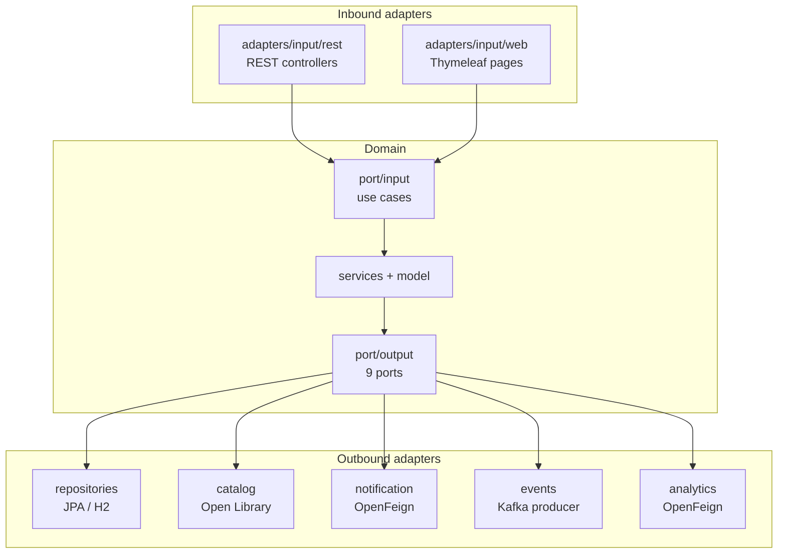
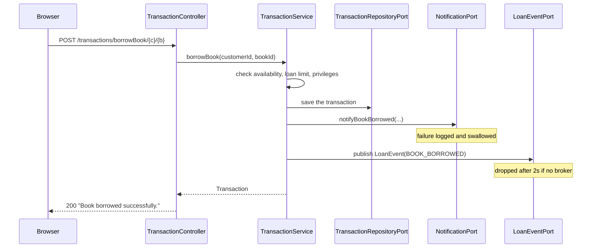

# Library backend

Spring Boot, Java 21, port 9092. Owns the catalogue, members, loans and identity, and serves the
REST API the frontend consumes. Source: `Library-Management-System-Version-2/`.

## Hexagonal architecture

The domain sits in the middle and depends on nothing. Everything reaching in or out crosses a
**port** — an interface owned by the domain — and an **adapter** implements it.

### Ports

**Input** (`domain/port/input/`) — what the application can be asked to do:

`BookUseCase` · `AuthorUseCase` · `CustomerUseCase` · `TransactionUseCase` · `ReminderUseCase`

**Output** (`domain/port/output/`) — what it needs from the outside world:

| Port                        | Adapter                                   | Talks to                |
| --------------------------- | ----------------------------------------- | ----------------------- |
| `BookRepositoryPort`        | `BookRepositoryPortAdapter`               | H2 via JPA              |
| `AuthorRepositoryPort`      | `AuthorRepositoryPortAdapter`             | H2 via JPA              |
| `CustomerRepositoryPort`    | `CustomerRepositoryPortAdapter`           | H2 via JPA              |
| `TransactionRepositoryPort` | `TransaktionRepositoryPortAdapter`        | H2 via JPA              |
| `ReminderPreferencePort`    | `ReminderPreferencePortAdapter`           | H2 via JPA              |
| `BookCatalogPort`           | `catalog/OpenLibraryAdapter`              | Open Library, over HTTP |
| `NotificationPort`          | `notification/NotificationServiceAdapter` | Notification-Service    |
| `LoanEventPort`             | `events/LoanEventKafkaPublisher`          | Kafka                   |
| `LoanStatisticsPort`        | `analytics/AnalyticsServiceAdapter`       | Analytics-Service       |

The last four are the point of the pattern: all four external systems are optional, each behind an
interface the domain defined, and each adapter decides on its own how to behave when the far end is
missing.

### Write ports swallow failures; read ports must not

`NotificationPort` documents that implementations *must* swallow delivery failures — notifying is
a side effect of borrowing, never a precondition of it.

`LoanStatisticsPort` does the opposite, and deliberately. It returns `Optional<LoanStatistics>`,
because empty statistics and unreadable statistics look identical on screen: "0 books tracked"
would be indistinguishable from a library that has genuinely never lent anything. The failure has
to stay visible all the way to the browser.

## Domain services

`domain/services/`:

| Service                                                                        | Responsibility                                           |
| ------------------------------------------------------------------------------ | -------------------------------------------------------- |
| `BookService`, `AuthorService`, `CustomerService`                              | Catalogue and membership                                 |
| `TransactionService`                                                           | Borrowing, returning, extending; enforces the loan rules |
| `ReminderService`, `LoanReminderService`                                       | Reminder preferences and the daily due-date sweep        |
| `CatalogImportService`, `CatalogEnrichmentService`, `CatalogDescriptionLookup` | Stocking shelves from Open Library                       |
| `JwtService`                                                                   | Issues and verifies tokens                               |

## Security

Two filter chains, because this application serves both an API and server-rendered pages
(`SecurityConfig.java`):

| Chain                    | Matches                                                                                 | Session       | Auth               |
| ------------------------ | --------------------------------------------------------------------------------------- | ------------- | ------------------ |
| `apiSecurityFilterChain` | `/api/**`, `/admin/**`, `/books/**`, `/authors/**`, `/customers/**`, `/transactions/**` | stateless     | JWT bearer token   |
| `webSecurityFilterChain` | everything else (`/`, `/login`)                                                         | `IF_REQUIRED` | form login, cookie |

The API chain answers with status codes rather than redirects: **401** when the token is missing or
rejected, **403** when the account may not go there. That is why logout has two doors —
`/api/logout` answers in JSON for the SPA, `/logout` for the browser form.

Admin-only: `/admin/**`, `/customers/**`, `/transactions/history/**`. Members read their own loans
through `/transactions/me` instead.

`DataInitializer` creates exactly one account at startup — the administrator. Self-registration only
ever creates members, so without it the admin screens have no way in.

### Tokens survive a restart

`library.jwt.secret` derives the signing key. Left blank, a fresh key is generated per start-up,
which invalidates every token ever issued — and with `spring-boot-devtools` watching `target/classes`
a restart happens on every code change. A configured secret is what makes local development usable;
it must be overridden by environment anywhere real.

## Request flow: borrowing a book

The two notes are the design: neither call can fail the borrow.

## Data

H2 in-memory, so everything is gone on restart. The console is at `/h2-console`
(`jdbc:h2:mem:library_ms`). The administrator is recreated at each start-up; self-registered members
are not.

Seeding depends on the profile:

| Profile | Seeder           | Source                                 |
| ------- | ---------------- | -------------------------------------- |
| `dev`   | `DatabaseSeeder` | bundled JSON in `resources/files/json` |
| default | `CatalogSeeder`  | Open Library, over the network         |

## Caching

`spring.cache.type=simple`, in memory. `spring-boot-starter-data-redis` is on the classpath, so
Boot would otherwise auto-select Redis and every cached call would fail against a server that is not
running. Cached: the Open Library lookups, which are slow and repeat.

## API

| Root                 | Purpose                                |
| -------------------- | -------------------------------------- |
| `/api`               | login, register, logout, current user  |
| `/api/profile`       | the signed-in account's own details    |
| `/api/reminders`     | due-date reminder preference           |
| `/books`, `/authors` | catalogue                              |
| `/customers`         | members (admin)                        |
| `/transactions`      | borrow, return, history                |
| `/admin`             | catalogue management, loans, analytics |

Responses carry HATEOAS links and HTTP cache headers. Swagger UI at `/swagger-ui.html`.

The API has quirks the client works around — paginated endpoints answer 404 rather than an empty
page, some routes return plain text, identifiers are `bookId`/`customerId` rather than `id`. They
are catalogued in [frontend.md](frontend.md) and in the frontend README.
