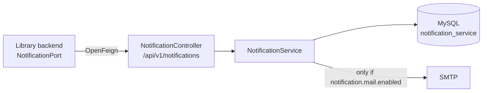

# Notification-Service

Spring Boot, Java 21, port 9093. Sends and records notifications, and stores each member's
notification preference. Source: `Notification-Service/Notification-Service/`.

**Optional.** The library calls it over OpenFeign with 2s connect / 3s read timeouts and swallows
every failure, so borrowing a book succeeds whether or not this service is running.

## Shape



A thin service: a controller, a service, two entities, two repositories. There is no domain layer
because there is no domain logic — it stores what it is told and tries to send it.

## API

All under `/api/v1/notifications`, which is the URL the library is configured to call
(`notification.service.url`).

| Method | Path                         | Purpose                            |
| ------ | ---------------------------- | ---------------------------------- |
| `POST` | `/`                          | send a notification (201)          |
| `GET`  | `/?userId=<uuid>`            | that member's notification history |
| `POST` | `/preferences`               | upsert a member's preference (201) |
| `GET`  | `/preferences?userId=<uuid>` | read a member's preference         |
| `GET`  | `/test`                      | liveness check, plain text         |

Preferences are **upserted** through one endpoint rather than split into create and update.

**This service has no authentication.** Members are identified by a `userId` UUID supplied by the
caller, and it trusts that caller. It is reachable only from the library backend on an internal
network; exposing 9093 publicly would let anyone read anyone's notification history.

## Data

MySQL, schema `notification_service`, created on connect.

**`Notification`** — one record per send attempt:

| Field                               | Notes                                             |
| ----------------------------------- | ------------------------------------------------- |
| `id`, `userId`                      |                                                   |
| `subject`, `body`, `recipientEmail` | what was to be sent                               |
| `type`                              | `NotificationType` — the delivery channel         |
| `status`                            | `NotificationStatus` — what became of the attempt |
| `failureReason`                     | populated on `FAILED`                             |
| `createdAt`                         |                                                   |

**`NotificationPreference`** — one per member: `userId`, `contactEmail`, `notificationEnabled`,
`type`, `createdAt`, `updatedAt`.

The library keeps the authoritative copy of a member's reminder preference; this is a mirror, so
losing it costs nothing.

## Status is not a delivery guarantee

A notification is **always persisted**, then the send is attempted. `NotificationStatus` records
what happened:

| Status      | Meaning                                                      |
| ----------- | ------------------------------------------------------------ |
| `PENDING`   | stored, not dispatched — what you get while mail is disabled |
| `SUCCEEDED` | handed to the mail server without error                      |
| `FAILED`    | attempted and failed; see `failureReason`                    |

`SUCCEEDED` means the SMTP server accepted it, not that it arrived.

`NotificationType` is the **channel**, and currently has one value: `EMAIL`.

## Mail is opt-in

`notification.mail.enabled` is **`false`** by default. Notifications are still persisted and
returned as `PENDING`, so nothing fails against an unconfigured mailbox. To send real mail, fill in
the SMTP credentials and flip the flag:

```properties
spring.mail.username=…
spring.mail.password=…
notification.mail.enabled=true
```

Defaults point at Gmail SMTP on 587 with STARTTLS.

## Tests

`src/test/resources/application.properties` pins H2 and disables mail, so the suite needs no MySQL
and no mailbox — a test that requires a database server fails on every machine without one,
including CI.

It also sets `spring.mail.host`, which looks redundant next to `notification.mail.enabled=false`
but is not: Spring only auto-configures the `JavaMailSender` that `NotificationService` takes as a
constructor argument when a host is present, and without it the context will not start.

## Running

```bash
cd Notification-Service
./mvnw spring-boot:run       # http://localhost:9093
```

Needs MySQL on 3306. See [`../../Notification-Service/README.md`](../../Notification-Service/README.md).
